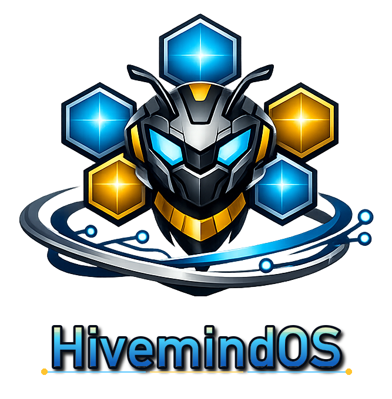
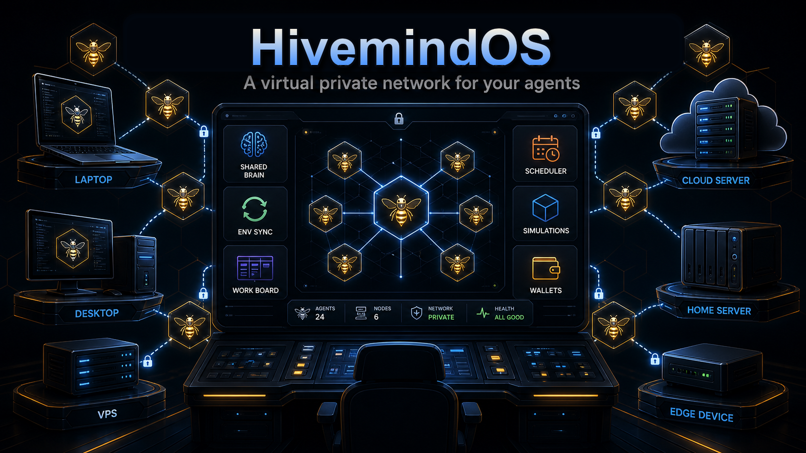
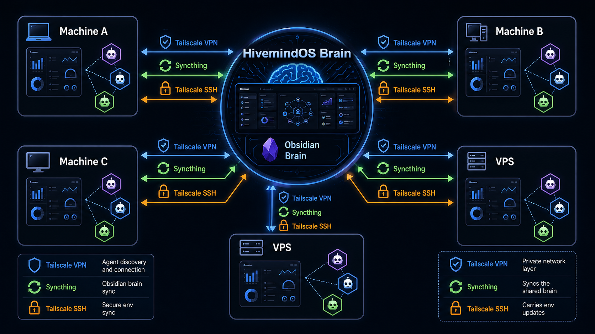

<div align="center">
  

  <p>
    <a href="https://github.com/LiamVisionary/hivemindos/stargazers"></a>
    <a href="https://github.com/LiamVisionary/hivemindos/network/members"></a>
    <a href="https://bankr.bot"></a>
  </p>
</div>

> **A virtual private network for your agents.**
>
> HivemindOS lets agents collaborate across all of your machines through one private control room. Connect agents over Tailscale, give them a shared Obsidian brain, sync environment variables safely, assign work, monitor progress, and manage the whole fleet from one simple dashboard.
>
> It supports modern agent runtimes like Hermes, OpenClaw, and Aeon, includes full MiroShark simulation integration, and can provision agent wallets on Base and Solana so agents can hold funds, pay for tools, and operate with their own controlled budgets.

Clone it, run one setup command, and get a local-first dashboard for the agents already living on your laptop, desktop, VPS, or spare machines. No public ports required.



## What It Does

- **See every agent from one dashboard** across this machine and trusted Tailscale-connected machines.
- **Cross-machine agent discovery and connection via Tailscale VPN** so agents can collaborate without public exposure.
- **Share one Obsidian brain** for memory, handoffs, skills, work boards, and shared context.
- **Share environment variables across agent machines** with `hive-env-add`, without copying secrets by hand.
- **Assign work to agents** through a shared Kanban board with retries, stale-work recovery, and human handoff.
- **Create and import schedules** so supported runtimes can keep working in the background.
- **Run MiroShark simulations** from the same control room.
- **Give agents controlled Base and Solana wallets** so they can pay for approved tools, APIs, transactions, and actions.
- **Earn Honey from regular agent usage** and convert it into HIVE, the HivemindOS token, to help fund agent compute.

## Quick Start

By default, setup uses **Hivemind Link**: an app-managed Tailscale node that uses your own Tailscale account without requiring the system Tailscale VPN client.

- For local-only use, you can skip Tailscale completely.
- For app-managed Fleet/chat access, run normal setup. Hivemind Link keeps the collector bound to localhost and exposes it only through the embedded Link sidecar.
- For full Tailnet extras such as Tailscale SSH env sync, rsync repair, and HivemindOS-managed Syncthing peer addressing, run `./setup.sh --system-tailscale`, then install/sign in to system Tailscale.
- On macOS, the App Store/sandboxed GUI build can join your Tailnet, but it cannot host the Tailscale SSH server. That is fine for VPN and Syncthing, but `hive-env-add` peer env sync and rsync repair from that Mac need a Tailscale SSH-capable host. Tailscale documents the macOS build differences here: [Three ways to run Tailscale on macOS](https://tailscale.com/docs/concepts/macos-variants).
- To make a macOS machine host Tailscale SSH, install the open-source `tailscale` + `tailscaled` CLI/daemon build from the [Tailscaled on macOS guide](https://github.com/tailscale/tailscale/wiki/Tailscaled-on-macOS), or use Homebrew:

```bash
brew install --formula tailscale
sudo brew services start tailscale
sudo tailscale up
sudo tailscale set --ssh
```

If setup detects the sandboxed macOS GUI build while running interactively, it can offer to run the Homebrew formula flow for you.

- On Linux machines that should host Tailscale SSH:

```bash
curl -fsSL https://tailscale.com/install.sh | sh
sudo tailscale up
sudo tailscale set --ssh
```

Then run HivemindOS setup:

```bash
git clone https://github.com/LiamVisionary/hivemindos.git
cd hivemindos
./setup.sh
```

On native Windows PowerShell, run:

```powershell
git clone https://github.com/LiamVisionary/hivemindos.git
cd hivemindos
powershell -ExecutionPolicy Bypass -File .\setup.ps1
```

Then open the dashboard printed by setup, usually:

```txt
http://localhost:5020
```

Setup checks Node.js and pnpm/Corepack, installs dependencies, installs `hive-env-add`, installs the lightweight machine monitor where supported, starts the dashboard when possible, and can open the dashboard for you. Production dashboard builds are skipped by default; use `./setup.sh --build` when you explicitly want one. On macOS/Linux use `setup.sh`; on native Windows use `setup.ps1`.

To remove HivemindOS later, run the matching uninstaller. It asks one prompt at a time before removing services, generated files, `hive-env-add`, shared-skill agent hints, or optional apps such as Tailscale, Syncthing, pnpm, GnuPG, and Obsidian:

```bash
./uninstall.sh
```

```powershell
powershell -ExecutionPolicy Bypass -File .\uninstall.ps1
```

## The First 10 Minutes

1. Run `./setup.sh`.
2. Open the dashboard.
3. Check **Fleet** for local and Tailscale-connected machines.
4. Open **Work** to create a task and assign it to your agents.
5. Open **Brain** to connect the shared Obsidian workspace.
6. Open **Scheduler** to import or create background jobs.
7. Add shared env vars when your agents need keys:

```bash
hive-env-add OPENAI_API_KEY
hive-env-add ANTHROPIC_API_KEY=...
```

## Honey, HIVE, And Compute

HivemindOS includes an opt-in rewards loop for normal agent usage:

1. The dashboard watches supported local runtimes while Honey rewards are enabled.
2. When a runtime reports real token usage, HivemindOS submits only the token delta to the official Honey ledger.
3. The ledger credits Honey to your workspace.
4. Available Honey can be exchanged for HIVE.
5. HIVE can be used to fund Bankr LLM credits for future agent compute.

Honey is the in-app reward meter. HIVE is the Bankr-launched token behind the reward economy. The official ledger is the source of truth, so editing the frontend display does not mint spendable HIVE. Rewards are capped by the official HIVE reward pool, which is funded from the configured share of creator fees, and observed runtime usage is deduped and capped server-side.

Privacy stays local-first. Honey rewards are disabled by default; you enable them from the Wallets view. When enabled, HivemindOS sends usage metadata such as workspace id, agent id, token count, model label, timestamp, source, and event id. Prompts, responses, files, wallet keys, and machine details are not sent to the Honey ledger.

Hermes CLI sessions are credited from Hermes' own persisted token counters when the dashboard is running. OpenClaw exposes token usage through its `/usage`, `/status`, CLI, and transcript usage surfaces; HivemindOS only credits OpenClaw once it can read real usage fields, not from text-length guesses. If you fork the reward backend to run your own ledger, that fork is no longer the official HIVE-compatible Honey ledger.

For spoof-proof Honey, use reward compute mode. Keep using Hermes, OpenClaw, or another OpenAI-compatible client directly, but set its provider endpoint to the HivemindOS reward gateway:

```txt
OPENAI_BASE_URL=https://hivemindos-compute-gateway.hivemindos.workers.dev/v1
OPENAI_API_KEY=hive-v1.<workspace-id>.<bankr-llm-key>
```

Your workspace id is stored at `~/.hivemindos/install-id` after setup. The gateway forwards the request through Bankr, reads the provider-returned token usage, signs the Honey receipt server-side, and credits official Honey without requiring the dashboard chat surface.

## Features

| Feature | What it does |
|---|---|
| **Fleet dashboard** | Tracks machines, agents, runtimes, health, tasks, logs, and capabilities in one place |
| **Tailscale agent network** | Connects agents across your machines through your private Tailscale VPN |
| **Machine monitor** | Lightweight local service that reports agent status and runtime health to the dashboard |
| **Runtime adapters** | Supports Hermes, OpenClaw, Aeon, MiroShark, and generic machine-backed agents through a neutral adapter layer |
| **Shared Obsidian brain** | Stores memory, handoffs, shared context, Kanban state, and reusable skills in a local markdown vault |
| **Shared env sync** | Adds keys once with `hive-env-add` and syncs them to trusted machines over Tailscale SSH |
| **Work board** | Gives agents a shared Kanban queue for tasks, delegation, retries, stale work, and human handoff |
| **Scheduler studio** | Creates, imports, pauses, resumes, and runs background schedules where runtimes support them |
| **Agent chat bridge** | Sends chat to supported runtimes through a local safety and redaction proxy |
| **MiroShark integration** | Runs and tracks MiroShark simulations from the HivemindOS dashboard |
| **Agent wallets** | Provisions controlled Base and Solana wallets for agents that need budgets or payment rails |
| **Honey rewards and HIVE compute** | Lets opt-in users earn Honey from measured agent token usage, exchange it for HIVE, and fund Bankr LLM compute with HIVE-backed credits |
| **Alerts** | Surfaces auth failures, stuck work, runtime issues, and handoff problems in one inbox |
| **Skill shelf** | Shares skills across Codex, Claude, Hermes, Gemini, OpenClaw, and Aeon |
| **Local-first storage** | Keeps runtime profiles, vault paths, and local URLs on your machine |

## Runtime Support

| Runtime | Current support |
|---|---|
| **Hermes** | Local HTTP/runtime adapter, session visibility from `~/.hermes`, chat bridge, tasks, logs, and process snapshots |
| **OpenClaw** | Gateway adapter with WebSocket chat, skill APIs, channel setup, schedules, memory sync, and env helpers |
| **Aeon** | Background-runtime adapter for `aeon.yml`, GitHub Actions-backed skills, run history, outputs, memory, and optional A2A skill calls |
| **MiroShark** | Companion integration for simulation workflows and dashboard visibility |
| **Generic machines** | Read-only machine snapshots through the local monitor |

No single runtime is required. HivemindOS works with one local agent, a mixed fleet, or future adapters.

## How Sharing Works



HivemindOS uses Tailscale in a few specific ways:

- **Agent connection:** the dashboard finds and connects to agent machines through your Tailscale VPN.
- **Hivemind Link:** optional app-managed Link nodes use Tailscale's embedded `tsnet` library to expose only the local HivemindOS collector over your own Tailscale account, without requiring the system Tailscale VPN client.
- **Env sync:** `hive-env-add` sends env updates to trusted peer machines over Tailscale SSH. Secret values travel through stdin, not command arguments, logs, or shared notes.
- **Brain sync:** the shared Obsidian vault is a local folder. In Brain, choose whether an external provider such as Obsidian Sync, iCloud Drive, Dropbox, Git, or another folder sync tool owns realtime sync, or let HivemindOS pair Syncthing over Tailscale.
- **Vault repair:** rsync over Tailscale SSH is available as an advanced fallback for one-shot push, pull, or bidirectional repair jobs. rsync repair conflicts are written as explicit `.conflict-host-timestamp` copies; Syncthing conflicts are handled by Syncthing in the vault and Syncthing UI.

Plaintext secrets do not belong in the shared vault. If GPG is configured, `hive-env-add` can refresh an encrypted `hive.env.gpg` backup in your chosen notes folder.

## Shared Env

Setup installs `hive-env-add` into `~/.local/bin`. GnuPG is optional; when it is installed and a recipient or public key is configured, `hive-env-add` refreshes the encrypted `hive.env.gpg` backup in the shared notes folder.

```bash
hive-env-add KEY=value
hive-env-add KEY
hive-env-add --import-env
hive-env-add --reconcile
hive-env-add --pull-from root@ubuntu.tailnet.ts.net
```

By default it updates the app `.env.local` and the generic local agent env store at `~/.hivemindos/.env`. Runtime-specific compatibility writes are explicit:

```bash
hive-env-add --runtime hermes ANTHROPIC_API_KEY
hive-env-add --runtime aeon OPENAI_API_KEY
hive-env-add --runtime openclaw TAVILY_API_KEY
```

When Tailscale SSH is available and env sync is enabled, HivemindOS updates trusted peer machines that report they are ready for env sync. Setup offers to pull missing keys from an existing ready peer and push this machine's keys to peers. `--reconcile` does the same push later, which is useful after adding a new device. `--pull-from USER@HOST` imports missing keys from a trusted peer and preserves local conflicts by default; use `--conflict remote-wins` or `--conflict fail` when you need a stricter merge. Advanced users can set `HIVE_ENV_TAILNET_TARGETS` to choose exact target machines.

## Shared Obsidian Brain

The Brain workspace can hold:

- agent inboxes
- shared context
- handoff notes
- memory files
- Kanban board state
- reusable skills
- runtime instructions

HivemindOS can auto-detect common local Obsidian vault locations, validate an explicit vault path, and fall back to local Kanban storage at `~/.hivemindos/kanban` if the vault is unavailable.

For multi-machine sharing, the built-in path pairs Syncthing over Tailscale so trusted machines each keep a local copy of the same vault. No Obsidian Sync subscription is required. If you already use Obsidian Sync, iCloud Drive, Dropbox, Git, or another provider, select that external sync owner in Brain so HivemindOS does not auto-pair Syncthing on top of it. When setup finds another Syncthing-capable collector and the Brain setting allows HivemindOS Syncthing, it can pair the shared vault and write/read a small test note to verify that sync is actually flowing.

For the full sync and networking model, see [Syncing And Tailscale Architecture](docs/syncing-and-tailscale.md).

## Multi-Machine Setup

On each additional machine that runs agents:

```bash
git clone https://github.com/LiamVisionary/hivemindos.git
cd hivemindos
./scripts/install-telemetry-collector.sh
```

The script installs the lightweight machine monitor and starts the services needed for dashboard discovery, env sync readiness, and optional Syncthing brain sync.

For app-managed Link mode instead of a system Tailscale install, use either normal setup or the collector-only command:

```bash
HIVE_LINK_ENABLED=true ./scripts/install-telemetry-collector.sh
```

The first run builds `bin/hivemind-linkd`, starts a localhost-only collector, and prints a Tailscale sign-in URL when the embedded app node needs authorization. Remote HivemindOS traffic then travels over Tailscale's encrypted device links, while the collector itself stays on `127.0.0.1`.

Use `./setup.sh --system-tailscale` only when you want the older full Tailnet setup surface: macOS firewall allow-listing, Tailscale SSH, rsync repair, and Syncthing pairing.

## Private By Default

- The machine monitor is read-only by default.
- Remote machines should stay private to Tailscale or Hivemind Link.
- In Hivemind Link mode, the collector binds to localhost and the `hivemind-linkd` sidecar is the only Tailnet-facing entry point.
- Chat requests pass through a local agent security proxy before reaching runtimes.
- Common secret formats are redacted before runtime output renders.
- Local skill actions use allowlisted folders and argument validation where the dashboard exposes direct skill execution.
- Agent profiles and local runtime URLs are not synced by the app.
- Broad API keys should not be placed into shared folders.

More detail: [docs/tailscale-fleet-telemetry.md](docs/tailscale-fleet-telemetry.md)

## Advanced Setup

```bash
./setup.sh --help
./setup.sh --non-interactive
./setup.sh --import-skills
./setup.sh --import-skills codex,hermes,aeon
./setup.sh --share-skills codex,openclaw
./setup.sh --no-shared-skills
./setup.sh --skip-deps
./setup.sh --build
./setup.sh --skip-collector
./setup.sh --skip-dashboard
./setup.sh --force
```

Automation can skip prompts with `CI=true`, `HIVE_SETUP_INTERACTIVE=false`, or explicit env choices:

```bash
HIVE_SHARED_SKILLS=true HIVE_SHARED_SKILL_IMPORTS=all HIVE_SHARED_SKILL_TARGETS=all ./setup.sh
HIVE_SHARED_SKILLS=false ./setup.sh
```

## Development

```bash
pnpm install
pnpm typecheck
pnpm lint
pnpm build
pnpm start
```

The dashboard runs on port `5020` by default.

Before committing any feature or user-visible fix, add an entry to `CHANGELOG.md` with the timestamp, commit status, verification, and intended commit-message summary. See `AGENTS.md` for the project rule.

## Roadmap

See [ROADMAP.md](ROADMAP.md).

## Provenance

HivemindOS packages agent-control patterns, OpenClaw integration code, HivemindOS workflow templates, MiroShark companion integration, and local-first fleet telemetry into a standalone open-source dashboard. Portions of the OpenClaw integration were adapted from an internal source app. The AI SDK route and chat UI patterns were adapted from public Next.js agent examples. Some workflow templates were inspired by `shannhk/hermes-agent-control-room`.
