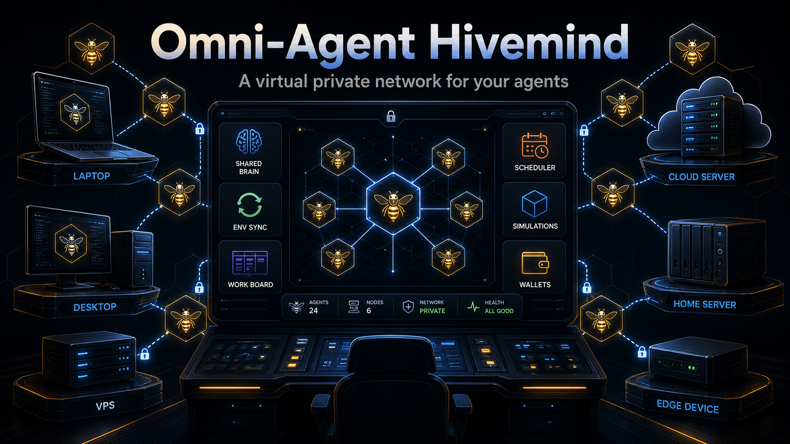

<div align="center">
  

  <h1>Omni-Agent Hivemind</h1>

  <p>
    <a href="https://github.com/LiamVisionary/omni-agent-hivemind/stargazers"></a>
    <a href="https://github.com/LiamVisionary/omni-agent-hivemind/network/members"></a>
    <a href="https://bankr.bot"></a>
  </p>
</div>

> **A virtual private network for your agents.**
>
> Omni-Agent Hivemind lets agents collaborate across all of your machines through one private control room. Connect agents over Tailscale, give them a shared Obsidian brain, sync environment variables safely, assign work, monitor progress, and manage the whole fleet from one simple dashboard.
>
> It supports modern agent runtimes like Hermes, OpenClaw, and Aeon, includes full MiroShark simulation integration, and can provision agent wallets on Base and Solana so agents can hold funds, pay for tools, and operate with their own controlled budgets.

Clone it, run one setup command, and get a local-first dashboard for the agents already living on your laptop, desktop, VPS, or spare machines. No public ports required.



## What It Does

- **See every agent from one dashboard** across this machine and trusted Tailscale-connected machines.
- **Cross-machine agent discovery and connection via Tailscale VPN** so agents can collaborate without public exposure.
- **Share one Obsidian brain** for memory, handoffs, skills, work boards, and shared context.
- **Share environment variables across agent machines** with `hive-env-add`, without copying secrets by hand.
- **Assign work to agents** through a shared Kanban board with retries, stale-work recovery, and human handoff.
- **Create and import schedules** so supported runtimes can keep working in the background.
- **Run MiroShark simulations** from the same control room.
- **Give agents controlled Base and Solana wallets** so they can pay for approved tools, APIs, transactions, and actions.

## Quick Start

```bash
git clone https://github.com/LiamVisionary/omni-agent-hivemind.git
cd omni-agent-hivemind
./setup.sh
```

Then open the dashboard printed by setup, usually:

```txt
http://localhost:5020
```

Setup checks Node.js and pnpm/Corepack, installs dependencies, installs the lightweight machine monitor, builds the dashboard, starts it when possible, and prints local plus Tailscale URLs when available. If Tailscale is installed and logged in, Hivemind enables cross-machine collaboration. If not, it runs cleanly as a local-only dashboard.

## The First 10 Minutes

1. Run `./setup.sh`.
2. Open the dashboard.
3. Check **Fleet** for local and Tailscale-connected machines.
4. Open **Work** to create a task and assign it to your agents.
5. Open **Brain** to connect the shared Obsidian workspace.
6. Open **Scheduler** to import or create background jobs.
7. Add shared env vars when your agents need keys:

```bash
hive-env-add OPENAI_API_KEY
hive-env-add ANTHROPIC_API_KEY=...
```

## Features

| Feature | What it does |
|---|---|
| **Fleet dashboard** | Tracks machines, agents, runtimes, health, tasks, logs, and capabilities in one place |
| **Tailscale agent network** | Connects agents across your machines through your private Tailscale VPN |
| **Machine monitor** | Lightweight local service that reports agent status and runtime health to the dashboard |
| **Runtime adapters** | Supports Hermes, OpenClaw, Aeon, MiroShark, and generic machine-backed agents through a neutral adapter layer |
| **Shared Obsidian brain** | Stores memory, handoffs, shared context, Kanban state, and reusable skills in a local markdown vault |
| **Shared env sync** | Adds keys once with `hive-env-add` and syncs them to trusted machines over Tailscale SSH |
| **Work board** | Gives agents a shared Kanban queue for tasks, delegation, retries, stale work, and human handoff |
| **Scheduler studio** | Creates, imports, pauses, resumes, and runs background schedules where runtimes support them |
| **Agent chat bridge** | Sends chat to supported runtimes through a local safety and redaction proxy |
| **MiroShark integration** | Runs and tracks MiroShark simulations from the Hivemind dashboard |
| **Agent wallets** | Provisions controlled Base and Solana wallets for agents that need budgets or payment rails |
| **Alerts** | Surfaces auth failures, stuck work, runtime issues, and handoff problems in one inbox |
| **Skill shelf** | Shares skills across Codex, Claude, Hermes, Gemini, OpenClaw, and Aeon |
| **Local-first storage** | Keeps runtime profiles, vault paths, and local URLs on your machine |

## Runtime Support

| Runtime | Current support |
|---|---|
| **Hermes** | Local HTTP/runtime adapter, session visibility from `~/.hermes`, chat bridge, tasks, logs, and process snapshots |
| **OpenClaw** | Gateway adapter with WebSocket chat, skill APIs, channel setup, schedules, memory sync, and env helpers |
| **Aeon** | Background-runtime adapter for `aeon.yml`, GitHub Actions-backed skills, run history, outputs, memory, and optional A2A skill calls |
| **MiroShark** | Companion integration for simulation workflows and dashboard visibility |
| **Generic machines** | Read-only machine snapshots through the local monitor |

No single runtime is required. Hivemind works with one local agent, a mixed fleet, or future adapters.

## How Sharing Works


Hivemind uses Tailscale in a few specific ways:

- **Agent connection:** the dashboard finds and connects to agent machines through your Tailscale VPN.
- **Env sync:** `hive-env-add` sends env updates to trusted peer machines over Tailscale SSH. Secret values travel through stdin, not command arguments, logs, or shared notes.
- **Brain sync:** the shared Obsidian vault can sync in realtime with Syncthing over Tailscale. Obsidian Sync, iCloud Drive, Dropbox, Git, Syncthing, or any normal folder sync provider also work.
- **Vault repair:** rsync over Tailscale SSH is available as an advanced fallback for one-shot push, pull, or bidirectional repair jobs.

Plaintext secrets do not belong in the shared vault. If GPG is configured, `hive-env-add` can refresh an encrypted `hive.env.gpg` backup in your chosen notes folder.

## Shared Env

Setup installs `hive-env-add` into `~/.local/bin`.

```bash
hive-env-add KEY=value
hive-env-add KEY
hive-env-add --import-env
```

By default it updates the app `.env.local` and the generic local agent env store at `~/.omni-agent-hivemind/.env`. Runtime-specific compatibility writes are explicit:

```bash
hive-env-add --runtime hermes ANTHROPIC_API_KEY
hive-env-add --runtime aeon OPENAI_API_KEY
hive-env-add --runtime openclaw TAVILY_API_KEY
```

When Tailscale SSH is available and env sync is enabled, Hivemind updates trusted peer machines that report they are ready for env sync. Advanced users can set `HIVE_ENV_TAILNET_TARGETS` to choose exact target machines.

## Shared Obsidian Brain

The Brain workspace can hold:

- agent inboxes
- shared context
- handoff notes
- memory files
- Kanban board state
- reusable skills
- runtime instructions

Hivemind can auto-detect common local Obsidian vault locations, validate an explicit vault path, and fall back to local Kanban storage at `~/.omni-agent-hivemind/kanban` if the vault is unavailable.

For multi-machine sharing, the built-in path pairs Syncthing over Tailscale so trusted machines each keep a local copy of the same vault. No Obsidian Sync subscription is required.

## Multi-Machine Setup

On each additional machine that runs agents:

```bash
git clone https://github.com/LiamVisionary/omni-agent-hivemind.git
cd omni-agent-hivemind
./scripts/install-telemetry-collector.sh
```

The script installs the lightweight machine monitor and starts the services needed for dashboard discovery, env sync readiness, and optional Syncthing brain sync.

## Private By Default

- The machine monitor is read-only by default.
- Remote machines should stay private to Tailscale.
- Chat requests pass through a local agent security proxy before reaching runtimes.
- Common secret formats are redacted before runtime output renders.
- Local skill actions use allowlisted folders and argument validation where the dashboard exposes direct skill execution.
- Agent profiles and local runtime URLs are not synced by the app.
- Broad API keys should not be placed into shared folders.

More detail: [docs/tailscale-fleet-telemetry.md](docs/tailscale-fleet-telemetry.md)

## Advanced Setup

```bash
./setup.sh --help
./setup.sh --non-interactive
./setup.sh --import-skills
./setup.sh --import-skills codex,hermes,aeon
./setup.sh --share-skills codex,openclaw
./setup.sh --no-shared-skills
./setup.sh --skip-deps
./setup.sh --skip-build
./setup.sh --skip-collector
./setup.sh --skip-dashboard
./setup.sh --force
```

Automation can skip prompts with `CI=true`, `HIVE_SETUP_INTERACTIVE=false`, or explicit env choices:

```bash
HIVE_SHARED_SKILLS=true HIVE_SHARED_SKILL_IMPORTS=all HIVE_SHARED_SKILL_TARGETS=all ./setup.sh
HIVE_SHARED_SKILLS=false ./setup.sh
```

## Development

```bash
pnpm install
pnpm typecheck
pnpm lint
pnpm build
pnpm start
```

The dashboard runs on port `5020` by default.

Before committing any feature or user-visible fix, add an entry to `CHANGELOG.md` with the timestamp, commit status, verification, and intended commit-message summary. See `AGENTS.md` for the project rule.

## Roadmap

See [ROADMAP.md](ROADMAP.md).

## Provenance

Omni-Agent Hivemind packages agent-control patterns, OpenClaw integration code, Hermes control-room workflows, MiroShark companion integration, and local-first fleet telemetry into a standalone open-source dashboard. Portions of the OpenClaw integration were adapted from an internal source app. The AI SDK route and chat UI patterns were adapted from public Next.js agent examples. The Hermes control-room workflow is inspired by `shannhk/hermes-agent-control-room`.
