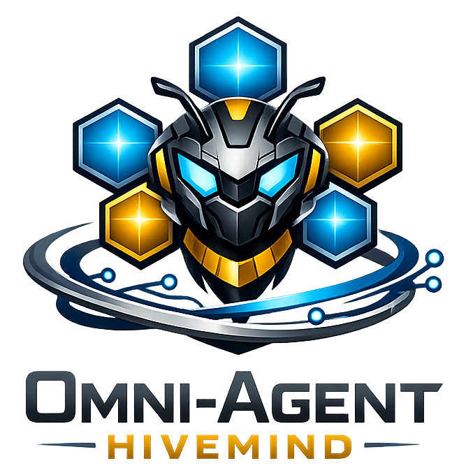

<div align="center">
  
  <h1>Omni-Agent Hivemind</h1>
  <p>
    <a href="https://github.com/LiamVisionary/omni-agent-hivemind/stargazers"></a>
    <a href="https://github.com/LiamVisionary/omni-agent-hivemind/network/members"></a>
    <a href="https://bankr.bot"></a>
  </p>
</div>

Omni-Agent Hivemind is a local-first control room for agent fleets spread across your own machines. It gives you one dashboard for Hermes, OpenClaw, and Aeon agents, discovers agent nodes over your private Tailscale network, and prepares a shared Obsidian workspace for memory, handoffs, and team coordination.

The goal is simple: clone the repo, run one setup command, and get a private dashboard that can see the agents running across your machines without exposing them to the public internet.

## What Works Today

- Machine-first dashboard that groups agents by Tailscale device.
- Read-only telemetry collector for macOS and Linux.
- Automatic Tailscale fleet probing through private `100.x.y.z` addresses.
- Hermes session, log, process, and task snapshots from local runtime folders.
- Multi-runtime agent profiles for Hermes, OpenClaw, and Aeon.
- Shared Obsidian vault configuration, forwarded to opted-in agents.
- Shared Kanban work board backed by Obsidian Sync, with local fallback.
- Local Hermes Agent Control Room path checks and bootstrap-risk inspection.
- OpenClaw gateway chat proxy, skill APIs, channel helpers, cron helpers, and security proxy.
- One-command setup script that installs dependencies, installs the collector, builds the app, starts the dashboard when possible, and prints local plus Tailscale URLs.

## Quick Start

```bash
git clone https://github.com/LiamVisionary/omni-agent-hivemind.git
cd omni-agent-hivemind
./setup.sh
```

The setup script checks for Node.js, pnpm/Corepack, and Tailscale. It installs dependencies, installs the read-only telemetry collector, builds the dashboard, starts it on port `5020` if the port is free, and prints the URL to open.

On each additional machine that runs agents:

```bash
git clone https://github.com/LiamVisionary/omni-agent-hivemind.git
cd omni-agent-hivemind
./scripts/install-telemetry-collector.sh
```

The dashboard will probe your Tailscale machines and show which ones have a collector running.

## Runtime Support

- **Hermes**: HTTP runtime adapter plus local collector visibility from `~/.hermes`.
- **OpenClaw**: local WebSocket gateway support, skill APIs, channel setup, environment helpers, and memory sync APIs.
- **Aeon**: HTTP/SSE adapter using the same profile model as Hermes.

Agent profiles live in browser local storage. Tokens and local URLs are not synced by the app.

## Tailscale Layer

Tailscale supplies the encrypted private network between your machines. Omni-Agent Hivemind does not require public ports or Tailscale Funnel for the default workflow.

Recommended shape:

- Install Tailscale on each agent machine.
- Run the telemetry collector on machines that host agents.
- Keep collector port `8787` reachable only inside your Tailnet.
- Use Tailscale ACLs so only trusted control-room devices can reach collectors.

More detail: [docs/tailscale-fleet-telemetry.md](docs/tailscale-fleet-telemetry.md)

## Shared Obsidian Brain

The dashboard includes shared vault settings for:

- agent inbox folder
- shared context note
- shared Kanban folder
- shared memory and handoff instructions
- local control-room path

Today, the app auto-detects common local Obsidian vault locations, validates an explicitly configured vault when provided, forwards the shared context to agent runtimes, and stores Work board `kanban.json` files under the shared Kanban folder. With Obsidian Sync enabled on each machine, agents and dashboards share the same board for handoffs, blockers, queued work, comments, and completion notes. If the vault is unavailable, the board falls back to `~/.openclaw/kanban`.

## Hermes Control Room

The project can use `shannhk/hermes-agent-control-room` as a control-plane template for docs, runbooks, registries, VPS setup, and Hermes deployment. The app currently inspects local control-room clones and flags live installer risks. One-click VPS provisioning is planned.

## Security Notes

- The telemetry collector is read-only.
- The collector does not install packages, mutate agents, or expose raw secrets.
- Keep collectors private to Tailscale.
- Do not put broad API keys into shared folders.
- Review and pin any external bootstrap scripts before running them.

## Development

```bash
pnpm install
pnpm typecheck
pnpm lint
pnpm build
```

Before committing any feature or user-visible fix, add an entry to
`CHANGELOG.md` with the timestamp, commit status, verification, and intended
commit-message summary. See `AGENTS.md` for the project rule.

To run the production build locally:

```bash
pnpm start
```

## Roadmap

See [ROADMAP.md](ROADMAP.md).

## Provenance

This project packages agent-control patterns and OpenClaw integration code into a standalone open-source app. Portions of the OpenClaw integration were adapted from an internal source app. The AI SDK route and chat UI patterns were adapted from public Next.js agent examples. The Hermes control-room workflow is inspired by `shannhk/hermes-agent-control-room`.
