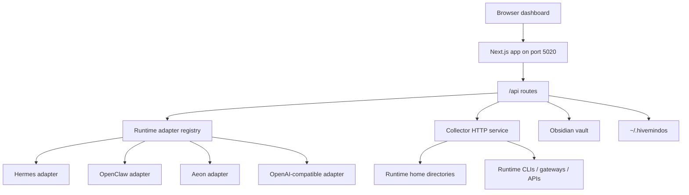
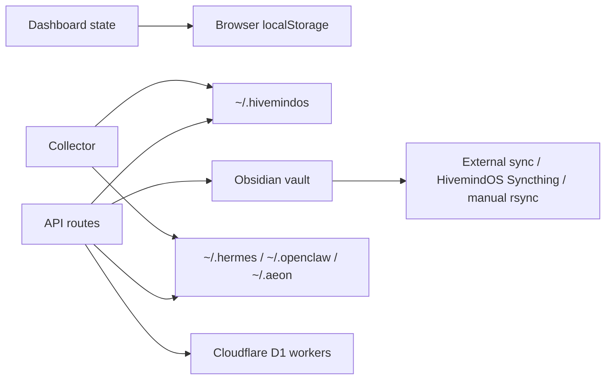

# Architecture

This page describes the current HivemindOS architecture as implemented in the repository. It is meant for contributors who need to understand where features live, how data moves, and which boundaries are safety-sensitive.

## System Goals

HivemindOS is built around five design constraints:

- Local-first operation: the dashboard, collector, runtime homes, and vault are local files and local services by default.
- Private fleet networking: cross-machine discovery and control happen through Tailscale or the app-managed Hivemind Link sidecar, not public ports.
- Runtime neutrality: Hermes, OpenClaw, Aeon, and OpenAI-compatible local servers are exposed through a common adapter surface where possible.
- Shared brain persistence: durable collaborative state lives in an Obsidian vault when available, with narrow local fallbacks for app continuity.
- Explicit safety surfaces: env sync, wallet actions, remote update, file access, and paid/API actions are routed through explicit APIs and UI controls.

## Main Components

| Layer | Primary files | Responsibility |
|---|---|---|
| Dashboard shell | `src/app/page.tsx`, `src/features/dashboard/DashboardApp.tsx` | Server-side view selection, client dashboard state, polling, navigation, and feature orchestration |
| Dashboard views | `src/features/dashboard/views/**`, `src/components/**` | Fleet, Work/Kanban, Brain/Vault, Chat, Wallet, More, Scheduler, Swarm, Notifications, Memory, Files, Env |
| API facade | `src/app/api/**/route.ts` | Local HTTP boundary for dashboard actions, runtime calls, fleet polling, vault access, wallets, Honey, MiroShark, and maintenance |
| Runtime adapters | `src/lib/services/runtime-adapters/**` | Common runtime interface for status, skills, schedules, runs, outputs, sessions, env sync, integrations, and model selection |
| Local services | `src/lib/services/**` | File-backed state, Obsidian services, telemetry, wallets, brain services, runtime utilities, integrations |
| Collector | `scripts/agent-telemetry-collector.mjs` | Small Node HTTP service on each machine for health, snapshots, runtime chat/session bridges, env sync, skills, directories, Syncthing, and E2E hooks |
| Setup scripts | `setup.sh`, `setup.ps1`, `uninstall.sh`, `uninstall.ps1`, `scripts/install-telemetry-collector.sh` | Installation, collector/Link service registration, helper CLI installation, uninstall mirror |
| Workers | `workers/honey-ledger`, `workers/compute-gateway` | Optional Cloudflare D1-backed Honey ledger and trusted OpenAI-compatible compute gateway |

## Runtime Process Model



The dashboard talks to local App Router APIs. Those APIs either perform local filesystem work directly, call the runtime adapter registry, or proxy to a local or remote collector. The collector is intentionally small and machine-local: it reads runtime state, exposes selected actions, and reports capabilities.

## Dashboard Architecture

The dashboard route is `src/app/page.tsx`. It accepts `view` and `vaultPanel` query parameters and renders `DashboardApp` with any server-prefetched work history needed for the History view.

`DashboardApp` is the main client orchestrator. It owns persisted local UI state, fleet polling, runtime availability, env state, wallets, chat state, scheduler state, MiroShark state, brain state, and feature wiring. Much of the behavior is delegated into focused hooks and view components:

- `src/features/dashboard/hooks/use-dashboard-polling-effects.tsx`: repeated polling for fleet, Kanban, and MiroShark state.
- `src/features/dashboard/hooks/use-kanban-task-controller.tsx`: board CRUD, task state changes, review/undo, and git status checks.
- `src/features/dashboard/hooks/use-kanban-dispatch-controller.tsx`: agent dispatch, runtime session polling, completion handling, and stalled work detection.
- `src/features/dashboard/hooks/use-scheduler-controller.tsx`: shared schedules and runtime schedule actions.
- `src/features/dashboard/hooks/use-agent-controller.tsx`: runtime integrations, agent creation, runtime sessions, and agent settings.
- `src/features/dashboard/hooks/use-miroshark-brain-controller.tsx`: MiroShark, Obsidian graph, shared skills, recent directories, GBrain, and shared notifications.
- `src/features/dashboard/hooks/use-wallet-files-controller.tsx`: wallets, Honey, runtime usage, MoneyClaw, x402, maintenance, and runtime files.
- `src/features/dashboard/hooks/use-status-chat-input-controller.tsx`: chat sending, setup/status helpers, Obsidian access, and sync actions.

The active top-level navigation currently exposes Fleet, Work, Brain, Chat, Wallet, and More. More links to maintenance, memory telemetry, runtime files, notifications, env, integrations, and related utility views.

## API Facade

The app uses Next.js route handlers under `src/app/api`. They form the dashboard's local trust boundary. Major route families are:

- `/api/fleet/*`: machine discovery, snapshots, updates, provisioning helpers.
- `/api/runtimes/*`: runtime status, integrations, skills, schedules, runs, outputs, env sync, sessions, availability.
- `/api/chat/*`: runtime chat bridge, session reads, and chat folders.
- `/api/kanban`: file-backed board CRUD, task moves, claims, completions, comments, events.
- `/api/obsidian/*`: vault status, open/access notes, sync, graph, skills, wallets, machine aliases, recent directories.
- `/api/scheduler/*`: shared schedule import, runtime actions, skill actions, folder browsing.
- OpenClaw runtime support is kept inside the generic runtime and chat layers rather than standalone product routes.
- `/api/miroshark/*`: companion status, install/start, swarm templates/runs, analysis.
- `/api/wallet/*`: local wallet creation, balances, sends, MoneyClaw, backups, x402 calls.
- `/api/brain/*`: GBrain and trading-brain status/install/query actions.
- `/api/env`, `/api/runtime-files`, `/api/maintenance`, `/api/memory-telemetry`, `/api/telemetry/events`, `/api/work-history`: local utility surfaces.

See [API And Storage Reference](api-and-storage.md) for route grouping details.

## Runtime Adapter Layer

Runtime adapters are registered in `src/lib/services/runtime-adapters/registry.ts`. The shared adapter type lives in `src/lib/services/runtime-adapters/types.ts`.

Known runtimes:

| Runtime | Kind | Current capabilities |
|---|---|---|
| OpenClaw | Gateway | status, chat, model selection |
| Hermes | Interactive | status, chat, runs, memory, session search, background tasks, X search, video generation, Codex runtime, Kanban decomposition, setup, wallet tools, model selection |
| Aeon | Background | status, skills, schedules, runs, outputs, memory, background tasks, notifications, setup |
| OpenAI-compatible | Interactive | status, chat, model selection |

Adapters let the dashboard ask a runtime for status, skills, schedules, runs, outputs, env sync, sessions, and model options without hard-coding every feature path into the UI. OpenClaw is intentionally limited to the generic Hivemind runtime bridge here.

## Collector Architecture

`scripts/agent-telemetry-collector.mjs` is the machine-local collector. It defaults to `AGENT_TELEMETRY_PORT=8787` and `AGENT_TELEMETRY_HOST=0.0.0.0`, though Link mode binds the collector privately and exposes it through the Hivemind Link sidecar.

Collector responsibilities include:

- `/health`: host, app version, env sync readiness, and capability advertisement.
- `/snapshot`: local runtime/machine snapshot data used by Fleet.
- `/agents`: local runtime agent inventory and creation/deletion.
- `/env`: read/import shared or runtime-specific env through `hive-env-add`.
- `/directories`: safe directory browsing for target selection.
- `/skills` and `/skills/auto-sync`: skill inventory and provider auto-sync.
- `/runtime-*` surfaces: runtime integrations, sessions, chat bridge, schedules, runs, outputs, env sync.
- `/syncthing/*`: Syncthing status/pairing support for shared vault sync.
- `/e2e/*`: real-fleet E2E hooks for env, skills, and encrypted file sharing.
- `/update`: start a checkout update on a remote HivemindOS machine.

The collector is designed to be private to the Tailnet or Hivemind Link path. Do not expose it publicly by default.

## State And Storage



Important storage locations:

- Browser `localStorage`: UI preferences, local agent config, cached dashboard state, chat history snippets, and user-selected settings.
- `~/.hivemindos`: install id, shared env, collector env, Kanban fallback, runtime agent registry, wallet vault, Honey ledger cache, runtime run cache, skill auto-sync config.
- Obsidian vault: shared brain, Kanban board files, notifications, scheduled-run files, wallet ledger notes, recent directories, shared skills, machine aliases, graph access logs, GBrain service notes.
- Runtime homes: Hermes, OpenClaw, Aeon, and local OpenAI-compatible server config/state.
- Cloudflare D1: optional official Honey ledger and compute gateway accounting.

## Shared Brain Model

The shared brain is a normal markdown folder, usually `~/Documents/Obsidian/hivemindos-vault`. The app can auto-detect common vault paths or use `NEXT_PUBLIC_OBSIDIAN_VAULT_PATH`.

The vault is not the transport. Sync is owned by exactly one selected owner:

- External provider: Obsidian Sync, iCloud Drive, Dropbox, Git, or user-managed Syncthing.
- HivemindOS Syncthing: dashboard pairs collectors and lets Syncthing replicate over Tailnet.
- Manual repair: dashboard runs one-shot rsync repair over Tailscale SSH.

See [Syncing And Tailscale Architecture](syncing-and-tailscale.md).

## Fleet Networking

Fleet discovery combines local state, Tailscale device data, Link metadata, and collector health checks. Hivemind Link is the default setup path for app-managed networking: it uses the user's own Tailscale account through an embedded `tsnet` sidecar, while keeping the collector bound to localhost.

Security posture:

- Keep collectors private to Tailscale or Link.
- Prefer read-only inspection by default.
- Remote update and env sync are explicit actions.
- Secret values move through helper commands and request bodies, not shared notes.
- Vault sync repair is explicit and writes conflict copies rather than silently overwriting.

## Wallet, Honey, And Compute

Local wallet state is managed through `src/lib/services/wallet/**`. Agent wallet secrets are stored in a local encrypted vault under `~/.hivemindos`, and optional backup records can be written into the shared vault when configured.

Honey has two paths:

- Local observation: the dashboard reads supported runtime usage and submits capped metadata.
- Trusted reward compute: `workers/compute-gateway` provides an OpenAI-compatible endpoint that forwards through Bankr/OpenRouter-compatible routing, reads provider usage, signs receipts, and submits them to `workers/honey-ledger`.

The official Honey ledger stores privacy-safe metadata only. It should not receive prompts, responses, local paths, machine names, Tailnet IPs, or wallet secrets.

## Build And Verification

Common checks:

```bash
pnpm lint
pnpm typecheck
pnpm build
```

Focused checks used during development:

```bash
pnpm test:kanban
pnpm test:dashboard-nav
pnpm test:fleet-local
pnpm test:gbrain-foundation
pnpm test:honey-economics
```

Real fleet E2E suites require suitable Tailnet machines and runtime setup:

```bash
pnpm test:e2e:real-fleet
pnpm test:e2e:agents
pnpm test:e2e:env
pnpm test:e2e:skills
pnpm test:e2e:file-share
pnpm test:e2e:kanban
pnpm test:e2e:dashboard-smoke
```
