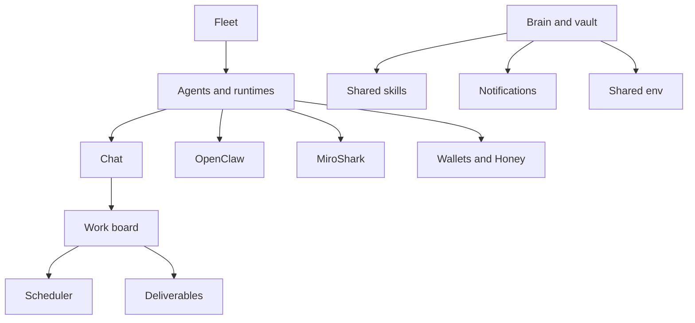

# Feature Guide

HivemindOS has a lot of surface area, so features are split into focused pages instead of one long reference file. Each page explains what the feature does, how it works internally, and what capabilities it exposes.

## Core Control Room

- [Fleet](fleet.md): machine discovery, health, collector snapshots, updates, and provisioning helpers.
- [Agents, Runtimes, And Chat](runtimes-and-chat.md): runtime profiles, adapters, model selection, streaming chat, sessions, and attachments.
- [Work Board And Scheduler](work-and-scheduler.md): Kanban tasks, agent dispatch, deliverables, schedules, and background jobs.

## Shared Brain

- [Brain, Vault, And Skills](brain-vault-and-skills.md): Obsidian vault, brain graph, shared skills, GBrain, note intake, and sync ownership.
- [Env, Files, Notifications, And Maintenance](env-files-notifications-maintenance.md): env sync, runtime files, notifications, memory telemetry, and repair checks.

## Integrations And Economy

- [MiroShark And Runtime Gateways](miroshark-and-openclaw.md): simulation, swarm rehearsal, and the minimal runtime-gateway integration points HivemindOS keeps.
- [Wallets, Honey, HIVE, And x402](wallets-honey-and-x402.md): agent wallets, local wallet vault, Honey rewards, compute gateway, and paid requests.
- [Integrations And Work History](integrations-and-work-history.md): Nango, dynamic changelog, and work history.

## Feature Map

