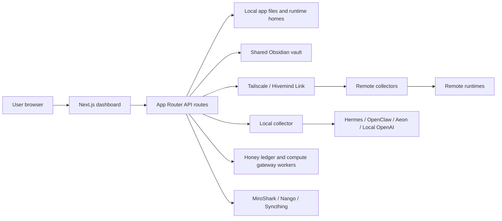

# HivemindOS Documentation

HivemindOS is a local-first control room for agent fleets. It connects local and Tailnet-reachable machines, gives agents a shared Obsidian brain, bridges multiple agent runtimes, manages background work, and adds optional wallet, Honey, HIVE, simulation, and integration surfaces.

This documentation set is organized so it can be published directly from the `docs/` folder with GitHub Pages.

## Start Here

- [Docs Preview](preview.html): local and GitHub Pages-style preview shell for the organized docs.
- [Architecture](architecture/index.md): system map, process boundaries, data flow, storage, runtime adapters, and deployment shape.
- [Feature Guide](features/index.md): organized feature pages covering what each product area does, how it works, and what capabilities it exposes.
- [API And Storage Reference](architecture/api-and-storage.md): route groups, collector endpoints, local files, Obsidian folders, workers, and verification commands.
- [Syncing And Tailscale Architecture](architecture/syncing-and-tailscale.md): shared brain sync ownership, HivemindOS Syncthing, and rsync repair.
- [Tailscale Fleet Telemetry](architecture/tailscale-fleet-telemetry.md): remote collector model and Tailnet security posture.

## Runtime And Integration Guides

- [Integrations](integrations/index.md)
- [MiroShark](integrations/miroshark/index.md)
- [Runtimes](runtimes/index.md)
- [Hermes Local Setup](runtimes/hermes/local-setup.md)

## Product And UI Guidance

- [Product And UI](product/index.md)
- [Design Philosophy](product/design-philosophy.md)
- [UI Rules](product/ui-rules.md)

## Repository Overview

The app is a Next.js 16 / React 19 project using the App Router. The primary dashboard lives in `src/features/dashboard`, server routes live under `src/app/api`, runtime-specific logic lives under `src/lib/services`, and optional Cloudflare Workers live under `workers/`.

Core commands:

```bash
pnpm dev
pnpm lint
pnpm typecheck
pnpm build
```

Port `5020` is the normal managed dashboard port. Project rules reserve that port for Liam's managed dev server, so ad hoc testing should use `5021` or higher unless explicitly directed otherwise.

## Architecture At A Glance



## Current Audit Snapshot

This documentation reflects a code audit of the repository on 2026-05-27 WITA. The main code paths checked were:

- Dashboard shell and views: `src/app/page.tsx`, `src/features/dashboard/**`, `src/components/**`
- API facade: `src/app/api/**`
- Runtime adapters: `src/lib/services/runtime-adapters/**`
- Shared state services: `src/lib/services/kanban/**`, `src/lib/services/obsidian/**`
- Collector and setup scripts: `scripts/agent-telemetry-collector.mjs`, `setup.sh`, `uninstall.sh`
- Workers: `workers/honey-ledger`, `workers/compute-gateway`
